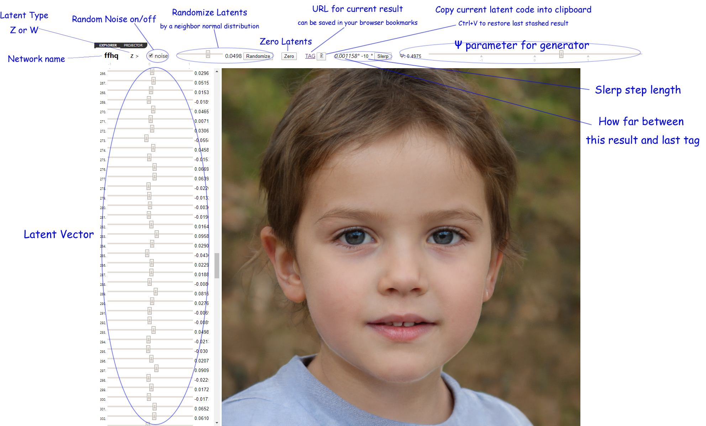
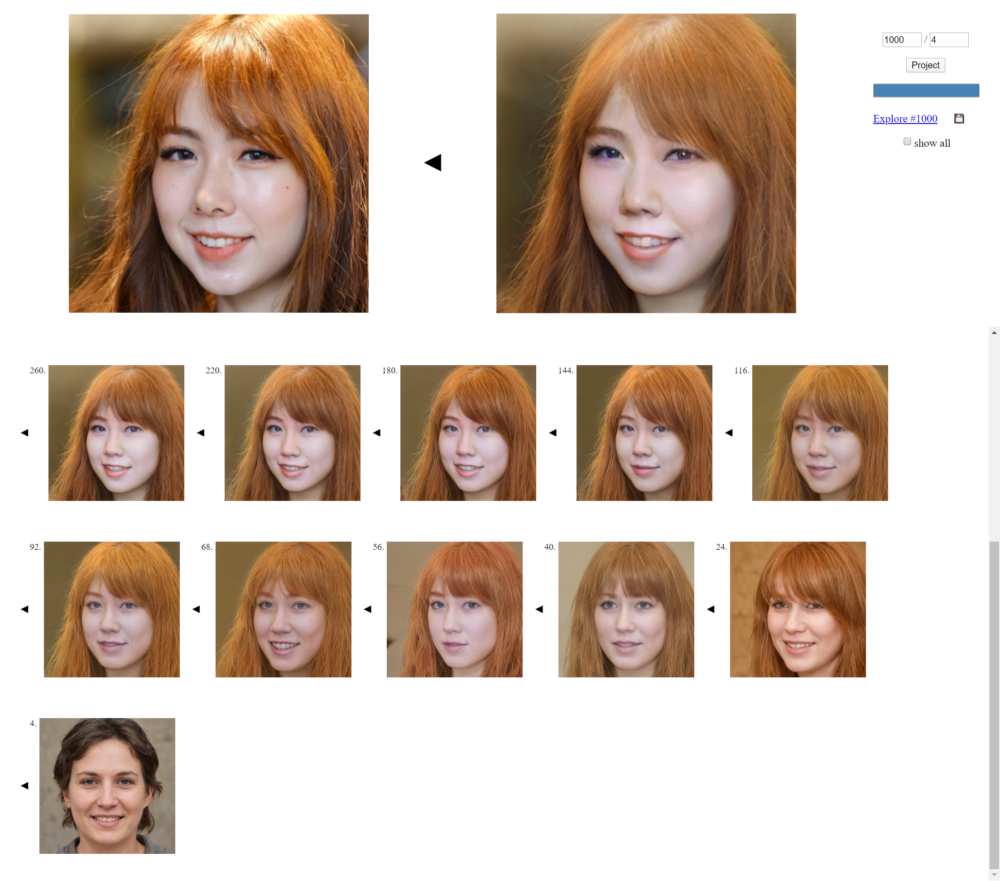
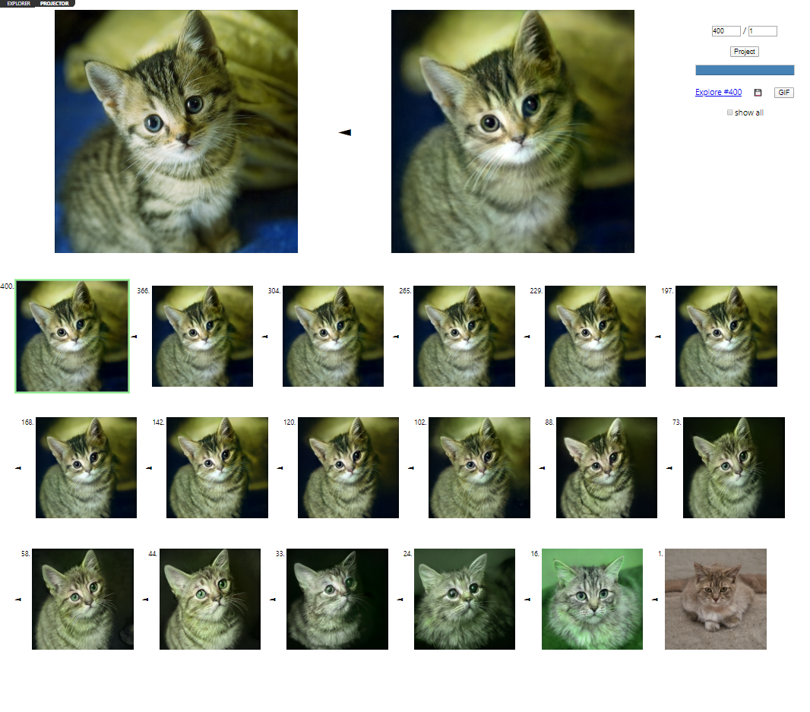
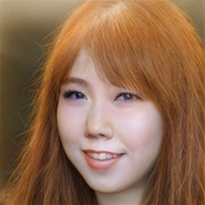
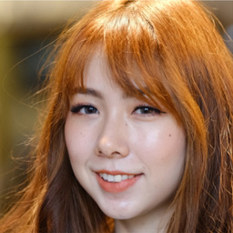
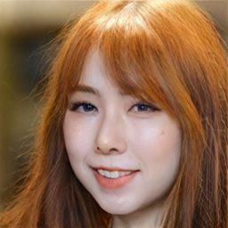
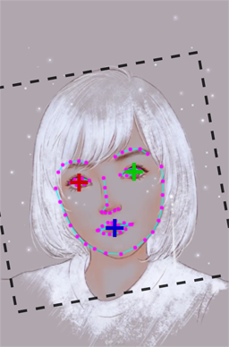
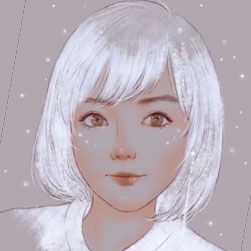

[](https://www.youtube.com/watch?v=6cCjX24hKwo)

This project is a web porting for [NVlabs' StyleGAN2](https://github.com/NVlabs/stylegan2), to facilitate exploring all kinds characteristic of StyleGAN networks.

Thanks for [NVlabs](https://github.com/NVlabs)' excellent work.

## Features

### Explorer

See how the result image response to changes of latent code & psi.



### Projector

Test the projection from image to latent code. Left is target image, right is result from generator model. Total step count and yielding interval can be configured in this page. And another hyperparameter `regularize noise weight` can be configured statically, see [Environment Configurations](#environment-configurations).

You can save the projection result in a zip package, and this page can accept projector zip file dropping, so this feature enable you to share your projector result to others.




#### W latent space extension

We added an env switch of `UNIFORM_LATENTS` to denote using *uniform* or *separated* W latent code when projecting image. This is the results comparison (center is the target):

<p align="center">
 &nbsp;&nbsp;&#x21e8;&nbsp;&nbsp; 
 &nbsp;&nbsp;&#x21e6;&nbsp;&nbsp; 

</p>

#### Projection animation exporting

You can also export image projection result sequence as a gif animation:

<p align="center">
 &nbsp;&nbsp;&#x21e6;&nbsp;&nbsp; 
</p>

#### Face image pose alignment

Dataset of [FFHQ](https://github.com/NVlabs/ffhq-dataset)'s generation has a crop process to align face area.<sup>[see paper](https://arxiv.org/abs/1710.10196), appendix C.</sup> So the output distribution of StyleGAN model learned on FFHQ has a strong prior tendency on features position. We observed that many face images projection suffers semantic mistakes, e.g. erasing original eyes and transforming eyebrow into eyes during projection fitting (however you can get a similar face at last, but it may yield freak results when you manipulate the latent code). Finally we figured out that mainly caused by unalignment with training dataset prior distribution.

Then we import the [face-api](https://github.com/justadudewhohacks/face-api.js) to measure and align human face images as below:

<p align="center" style="white-space: nowrap">
	
	- &#x1F642; &#x2192;
	
	- &#x2704; &#x2192;
	
</p>

*Gratefulness for the authorization by [@芈砾](https://www.douban.com/people/43619507/) to use his nice [opus](https://www.douban.com/photos/photo/2575639110/).*

Click the button [&#x1F642;] after target image loaded, if the face detection succeed, you will get the face landmark and proposed crop box. The detection result may be not very accurate, now you can adjust 3 anchor marks manually to align left eye (red), right eye (green) and mouth (blue). Then click button [&#x2704;] to apply the crop.

### Merger

Once you get some latent codes by projector or turning, you can test to mix features by interpolating latent values on every W layer. This is a demo.


The pair of top-left images are the source to merge, press **Ctrl+V** in the hash box below either image to paste input latent code via clipboard, and **Ctrl+C** on the right blank area to copy result latent code.

### Mapping Network Research

[](https://k-l-lambda.github.io/2020/02/10/stylegan-mapping/)

I attempt to explore the StyleGAN mapping network high-dimensional terrain aspect, [**read this article**](https://k-l-lambda.github.io/2020/02/10/stylegan-mapping/) for details.

## Usage

Run the web server:

```.bash
python ./http_server.py
```

If this works, open *http://localhost:8186* in your browser.

To ensure it working, please read the following requirements before do this.

## Requirements

### Python

Install requirement libraries with pip, reference to [requirements.txt](./requirements.txt).

### Network Files

Before run the web server, StyleGAN2 pre-trained network files must be placed in local disk (recommended the folder `models`). You can download network files following to [StyleGAN2's code](https://github.com/NVlabs/stylegan2/blob/master/pretrained_networks.py).

For memory reason, only one generator model can be loaded when running the web server. Network file paths can be configured by env variables. Create a file named `.env.local` under project root to configure chosen model and network file paths. Network file name/paths are configured in key-value style, e.g.:

<a name="model-paths-example"></a>
```.env
MODEL_NAME=ffhq		# ffhq is the default value, so this line can be ignored 

MODEL_PATH_ffhq=./models/stylegan2-ffhq-config-f.pkl
MODEL_PATH_cat=./models/stylegan2-cat-config-f.pkl
# And so on...
```

Alternately, you can also choose generator model name by start command argument, e.g.:

```.bash
python ./http_server.py cat
```

Or, for nodejs developer:

```.bash
yarn start cat
```

Besides generators, the network *LPIPS* is required when run image projector, the default local path is `./models/vgg16_zhang_perceptual.pkl`, [download link](https://drive.google.com/uc?id=1N2-m9qszOeVC9Tq77WxsLnuWwOedQiD2). You can also change local path by env variable `MODEL_PATH_LPIPS`.

### For Windows

According to [StyleGAN2 README.md](https://github.com/NVlabs/stylegan2#requirements), here are our additional help instructions:

* MSVC

	**NOTE**: Visual Studio 2019 Community Edition seems not compatible with CUDA 10.0, Visual Studio 2017 works.

	Append the actual msvc binary directory (find in your own disk) into `dnnlib/tflib/custom_ops.py`, the array of `compiler_bindir_search_path`. For example:

	```patch
	-	'C:/Program Files (x86)/Microsoft Visual Studio 14.0/vc/bin',
	+	'C:/Program Files (x86)/Microsoft Visual Studio/2017/BuildTools/VC/Tools/MSVC/14.16.27023/bin/Hostx64/x64',
	```

* NVCC

	To test if nvcc is configured properly, dowload [test_nvcc.cu](https://github.com/NVlabs/stylegan2/blob/master/test_nvcc.cu) in StyleGAN2 project. And the test command should specify binary path:

	```.bash
	nvcc test_nvcc.cu -o test_nvcc -run -ccbin "C:\Program Files (x86)\Microsoft VisualStudio\2017\BuildTools\VC\Tools\MSVC\14.16.27023\bin\Hostx64\x64"
	```

	Actual path to different msvc edition may have difference in detail. If this succeed, it will build a file named `test_nvcc.exe`.

* Tips for tensorflow 1.15

	Tensorflow 1.15 can work under Windows, but *NVCC* compiling may encounter C++ including path problem. Here is an easy workaround: make a symbolic link in python installation directory `Python36\Lib\site-packages\tensorflow_core`:

	```.bash
	mklink /J tensorflow tensorflow_core
	```

* cudafe++ issue

	If you encountered python console error like:
	
	```
	nvcc error : 'cudafe++' died with status 0xC0000005 (ACCESS_VIOLATION)
	```

	That may caused by a bug from CUDA 10.0, you can fix this issue by replacing your `cudafe++.exe` file in CUDA program bin directory by the same name file from CUDA 10.1 or higher version. And you are welcome to download my [backup](./documents/cudafe++.zip) to avoid install a whole new version CUDA.

## Environment Configurations

To manage environment variables conveniently, create a configuration file named `.env.local`. All avaiable env list:

Key							| Description							| Default Value
:--							| :--									| :--
**HTTP_HOST**				| Web server host.						| *127.0.0.1*
**HTTP_PORT**				| Web server port.						| *8186*
**MODEL_NAME**				| Name for the generator model to load, this can be overwrite by the first argument of *[start script](./package.json#L7)*.	| *ffhq*
**MODEL_PATH_LPIPS**		| File path for LPIPS model.			| *./models/vgg16_zhang_perceptual.pkl*
**MODEL_PATH_***			| Generator network file path dictionary. See [examples](#model-paths-example).	|
**REGULARIZE_NOISE_WEIGHT**	| Projector training hyperparameter. Float.	| *1e5*
**INITIAL_NOISE_FACTOR**	| Projector training hyperparameter. Float.	| *0.05*
**EUCLIDEAN_DIST_WEIGHT**	| Projector training hyperparameter. Float.	| *1*
**REGULARIZE_MAGNITUDE_WEIGHT**	| Projector training hyperparameter. Float.	| *0*
**UNIFORM_LATENTS**			| Use uniform latents for all feature layers (consistent with origin StyleGAN2 paper). Boolean, 0 or 1	| *0*
